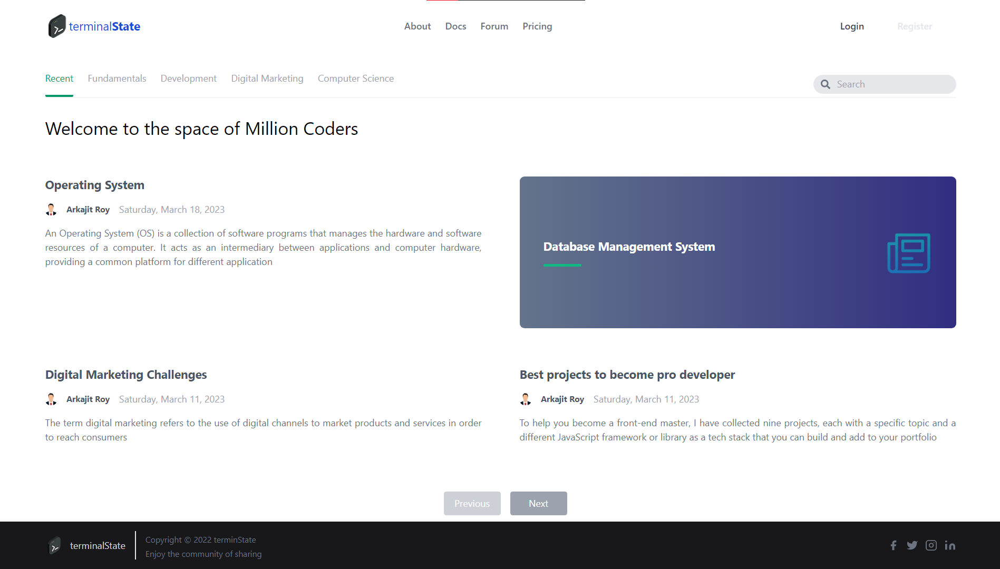
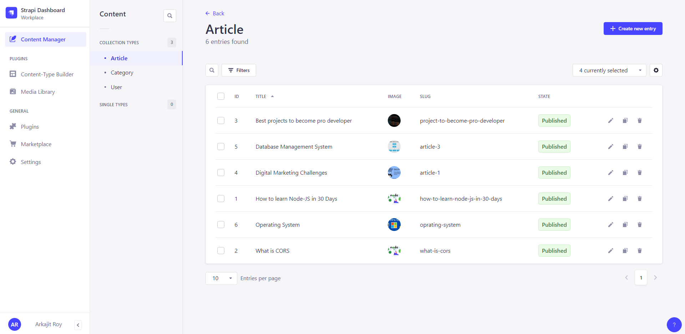

## terminalState-Next

TerminalState is a Blogging Website which is made based on coding community, where people can share there code snippets or articles.

#### Technology used:

| Technology       | About the Framework/ Technology                               |
| ---------------- | ------------------------------------------------------------- |
| **Next-JS/TS**   | For Client side and server side rendering                     |
| **STRAPI-CMS**   | For Backend API section, i have used strapi to handle content |
| **Tailwind-CSS** | For Styling purpose                                           |

#### ⚡ Installation Guide

First clone the repository from the github

```
git clone https://github.com/arkajitroy/terminalState-Next.git
```

After that go to the specific directories `client_next_server` and `strapi_web_server`

And quickly install the node-mudules by `npm install` or `npm i --legacy-peer-deps`

After installation of all node mudules start the server.

```
npm run dev // FOR NEXT-JS

npm run develop // FOR STRAPI-CMS
```

### Demo of the application

#### TerminalState (Main Home)



#### TerminalState (Strapi Home)


